# PassForge 🔐


🇨🇳 **安全优先的密码生成器** - 完全在浏览器端运行，采用军用级加密技术  
🇺🇸 **Privacy-First Password Generator** - Runs entirely in browser with military-grade encryption

[🇨🇳 在线体验](https://https://liuzexiao.com/pwd/index.html)


## ✨ 功能特性 / Features

### 🇨🇳
- 🔐 **零数据传输** - 所有操作在本地完成
- 🛡️ **加密安全** - 使用`window.crypto.getRandomValues`
- 🎛️ **自定义生成**：
  - 密码长度（8-64位）
  - 字符类型选择：
    - 大写字母（A-Z）
    - 小写字母（a-z）
    - 数字（0-9）
    - 符号（!@#$%^&*）
- 📋 **智能复制** - 自动切换现代/传统复制方式
- 📱 **响应式设计** - 适配所有设备

### 🇺🇸
- 🔐 **Zero Data Transfer** - All operations local
- 🛡️ **Cryptographically Secure** using Web Crypto API
- 🎛️ **Custom Generation**:
  - Length control (8-64 chars)
  - Character sets:
    - Uppercase (A-Z)
    - Lowercase (a-z)
    - Numbers (0-9)
    - Symbols (!@#$%^&*)
- 📋 **Smart Copy** - Auto clipboard fallback
- 📱 **Responsive Design** - Mobile-ready

## 🚀 快速开始 / Getting Started

### 🇨🇳
```bash
git clone https://github.com/irtb/PassForge.git
cd PassForge
# 直接打开index.html即可
```

### 🇺🇸
```bash
git clone https://github.com/irtb/PassForge.git
cd PassForge
# Simply open index.html in browser
```

## ⚙️ 技术细节 / Technical Specs



| 指标/Metric       | 数值/Value |
|-------------------|------------|
| 16位生成时间      | <1ms       |
| 64位生成时间      | <3ms       |
| 内存使用峰值      | <2MB       |

## 🔒 安全声明 / Security

### 🇨🇳
- 🚫 永不联网 - 无任何网络请求
- 💾 零存储 - 密码仅在内存中存在
- 🔍 透明代码 - [查看完整源码](index.html)
- 📜 符合GDPR标准

### 🇺🇸
- 🚫 No Networking - Zero HTTP calls
- 💾 No Storage - Password in memory only
- 🔍 Transparent Code - [View Source](index.html)
- 📜 GDPR Compliant

## 🤝 参与贡献 / Contributing

### 🇨🇳
1. Fork 项目仓库
2. 创建特性分支 (`git checkout -b feature/新功能`)
3. 提交修改 (`git commit -m '添加新功能'`)
4. 推送分支 (`git push origin feature/新功能`)
5. 发起Pull Request

### 🇺🇸
1. Fork the Project
2. Create your Branch (`git checkout -b feature/NewFeature`)
3. Commit Changes (`git commit -m 'Add NewFeature'`)
4. Push to Branch (`git push origin feature/NewFeature`)
5. Open a PR

## 📜 许可证 / License
MIT License - 详见 [LICENSE](LICENSE) 文件

## 📧 联系方式 / Contact
**玄霄 / Walternate**  
📧 warlter2017@gmail.com  
🌐 [项目主页](https://github.com/irtb/PassForge)
```
